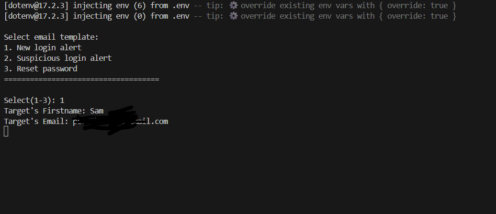

# FaceBook Email Templates

**Description:** This tool consist of three main facebook email templates, this gives the privilege of simulating phishing attacks and credential harvesting through gmail in safe and secured lab setup.



>⚠️This tool is for educational purposes only, please do not use without target's proper authorization.

## Installation & Setup

- Clone the repository or download the zip for this project

    ```bash
    git clone https://github.com/Sammy750-cyber/facebook_mail_sender

    cd facebook_mail_sender
    ```

- Install dependencies
    ```bash
    npm install
    ```
- Configure `.env` file
    ```bash
    EMAIL_SERVICE = gmail
    EMAIL_USER = # your gmail - best that u create a new one
    EMAIL_PASS = # Email password
    EMAIL_TO = # reciever (optional)


    PHISHING_URL = http://localhost/path-to-your-site

- After proper configuration, run the program
    ```bash
    node app.js
    ```

## Credits

If you enjoyed using this tool or you found it useful, kindly leave and star and follow for more.